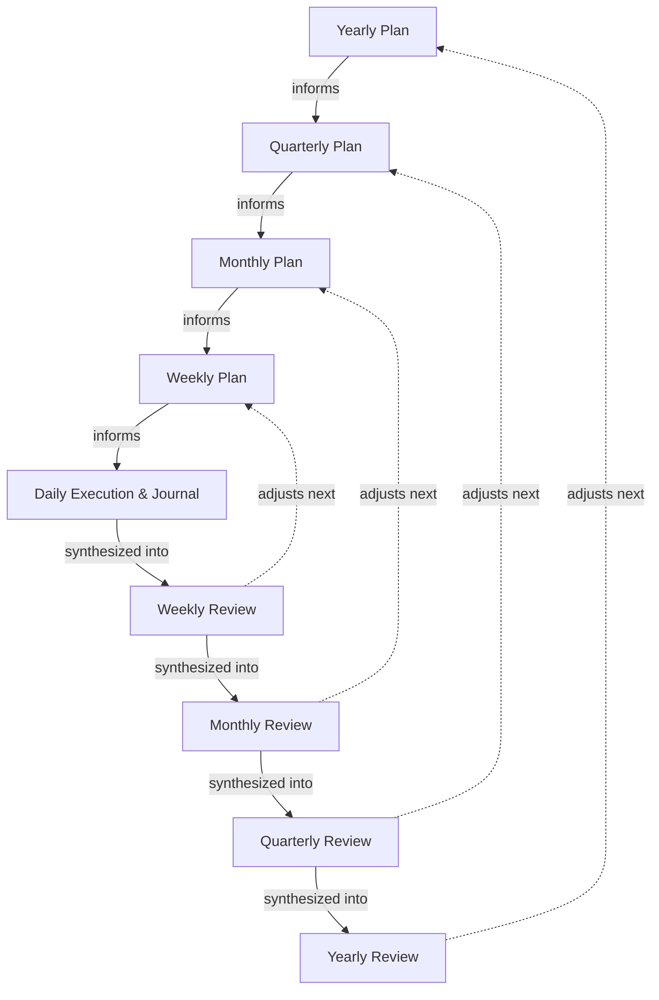

# LLM Coach Framework

An automated, LLM-powered coaching framework built entirely in Obsidian Markdown. The repository ships with a default persona—a helpful, objective AI life coach.

The architecture is entirely text-based, allowing you to feed your daily natural language notes, external metrics, and systemic goals directly into an LLM. This repository ships with a `AGENTS.md` workflow that allows you to easily recreate your coach's persona. When you change the persona, the framework updates your coach's tone and methodology while leaving your core planning and review prompts intact.

***

## 🏗️ System Architecture

The framework bridges the gap between high-level vision and daily execution through a streamlined, high-impact structure designed around the **80/20 Rule**: minimize daily friction by relying on unstructured inputs. 

**Note: Using the LLM is completely optional.** You can manually write out your plans and reviews for any period. However, the system is designed to let the LLM do the heavy lifting of synthesis, structuring, and evaluation during periodic reviews and planning sessions when requested.

### Information Flow

The system uses a top-down approach for planning, and a bottom-up approach for reviews:



1. **Direction & Strategy (Plan)**: Long-term trajectory, domain alignment, periodic objectives, and current active priorities (all unified in one periodic file).
2. **Execution (Projects)**: Actionable breakdowns bridging priorities to daily tasks.
3. **Action (Daily)**: Executing plans from higher levels and logging unstructured natural language journal entries.
4. **Accountability (Reviews)**: 100% LLM-driven continuous coaching logs.

### Directory Structure

- `USER.md`: Basic user profile (name, DOB, location) *(System Output)*
- `COACH.md`: Coach identity, tone, and planning & review strategy *(System Output, not committed)*
- `SCHEDULE.md`: User's typical weekly/daily shape, fixed commitments, and system placements *(System Output)*
- `yearly/`: Long-term vision, objectives, active priorities, and experiments (`YYYY.md`) *(System Output)*
- `quarterly/`: Quarterly plans and reviews (`YYYY-[Q]Q.md`) *(Optional)*
- `monthly/`: Monthly plans and reviews (`YYYY-MM.md`) *(Optional)*
- `weekly/`: Weekly plans and reviews (`gggg-[W]ww.md`) *(Optional)*
- `domains/`: Areas of ongoing responsibility and standard maintenance (e.g., `health.md`, `career.md`). These represent the different aspects of your life you want to manage. *(User Input)*
- `systems/`: The mechanisms, routines, and environments that support your domains and goals (e.g., `habits.md`, `environment.md`). Good systems make success inevitable. *(User Input)*
- `metrics/`: Output directory for external structured data (e.g., Apple Health exports, Oura ring data) *(User Input)*
- `daily/`: Daily journals (`YYYY-MM-DD.md`) *(User Input)*
- `projects/`: Actionable project files linked to priorities *(User Input)*
- `templates/`: Obsidian templates for periodic notes and projects

***

## 📖 User Guide (Obsidian Setup & Workflow)

This system relies heavily on Obsidian's core features (Templates, Daily Notes) and markdown linking.

### 1. Installation & Setup

1. **Fork this repository** on GitHub to your own account.
2. **Set your fork to private** (Repository Settings > Danger Zone > Change repository visibility) to ensure your personal coaching data remains secure.
3. **Clone your private fork** to use as your starter vault (replace `your-username` with your actual GitHub username):
   ```bash
   git clone https://github.com/your-username/llm-coach.git
   ```
4. Open the cloned folder (`llm-coach`) as a **Vault in Obsidian**.

### 2. Setting Up Your Coach

Run the single setup command to create your coach and configure your domains, systems, and schedule in one guided session:

```text
Setup
```

The LLM will interview you one question at a time, walking through:

1. **User profile** — basic details written to `USER.md`
2. **Coach identity** — your coaching style, tone, and planning/review strategy, written to `COACH.md`
3. **Domains** — the life areas you actively manage, generated as files in `domains/`
4. **Systems** — the routines and mechanisms that support your domains, generated as files in `systems/`
5. **Schedule** — the actual shape of your week, fitted around your fixed commitments, written to `SCHEDULE.md`

`COACH.md` is not committed to the repo, so it stays personal to your vault.

### 3. Bootstrapping Your Plan

Once your domains and systems are in place, establish your baseline plan. Ask the LLM to guide you, for example:

```text
Help me create my plan for this year
```

The LLM will use the pre-provided `prompts/yearly_plan.md` workflow to interview you and produce `yearly/YYYY.md`.

Once the plan is generated, create new files in the `projects/` folder for any priority that requires multiple steps. Apply the `Project Template`, which includes `start_date` and `end_date` in the YAML frontmatter, and define the immediate Next Action.

### 4. The Daily Workflow

The daily tracking relies entirely on unstructured natural language text to minimize friction. Use the daily note to execute plans from higher levels and maintain a journal. No daily metrics or YAML frontmatter are required here.

1. Use the pre-installed Periodic Notes plugin to open the note for the current day. Press `Cmd` or `Ctrl + P` to open the command palette and search for `Periodic Notes: Open daily note`.
2. Write a quick unstructured brain-dump or list of what you intend to do, execute on your weekly plan, and log a brief summary of what happened during the day.

### 5. LLM-Driven Reviews (Continuous Coaching)

Instead of maintaining a separate review log, **all reviews are LLM-driven and appended to the** **`# Review`** **section of your periodic notes (e.g.,** **`weekly/gggg-[W]ww.md`** **or** **`monthly/YYYY-MM.md`)**.

Whenever you need a review (end of week, month, or when feeling stuck):

1. Ask your LLM (using the `AGENTS.md` context) to run a review.
2. The LLM will analyze any external structured data placed in `metrics/` (e.g., Apple Health exports), your recent `daily/` notes, and your active periodic plan.
3. The LLM will append a new section to the `# Review` heading containing:
   - Data & Goal Evaluation
   - Constraint Analysis
   - Hard Truths
   - Adjustments & Next Directives
4. **Reset Priorities**: Based on the LLM's feedback, ruthlessly prune the Priorities section in your active plan. Ensure you have no more than 5.

***

## 🤖 How to interact with the LLM

Because this repository includes a `AGENTS.md` file, AI coding assistants and IDEs will automatically recognize your coaching rules. You can interact with the system in two ways:

### Option A: Using Claude Code

If you use Anthropic's official CLI tool, [Claude Code](https://docs.anthropic.com/en/docs/agents-and-tools/claude-code/overview):

1. Open your terminal and navigate to your cloned `llm-coach` repository.
2. Start the interactive session by running:
   ```bash
   claude
   ```
3. Claude Code will automatically read `AGENTS.md` and use the established coach configuration.
4. Interact with your coach directly from the terminal (e.g., "Change the persona" or "Help me create my plan for this year").

### Option B: Using an AI IDE

If you use an AI-powered IDE like Trae, Cursor, or Windsurf:

1. Open the cloned repository in your IDE.
2. Open the chat panel. The IDE will automatically read `AGENTS.md` as the system instructions.
3. Start by asking the AI to guide your planning, or ask it to customize your coach. (e.g., "Help me create my plan for this year").

